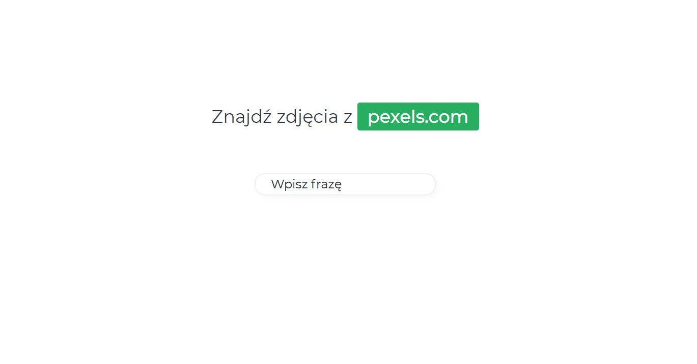
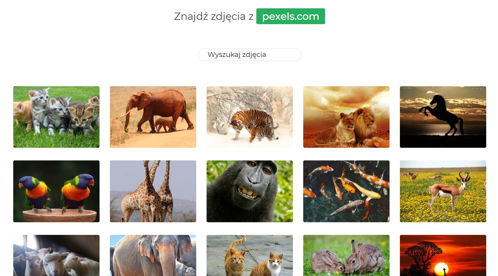
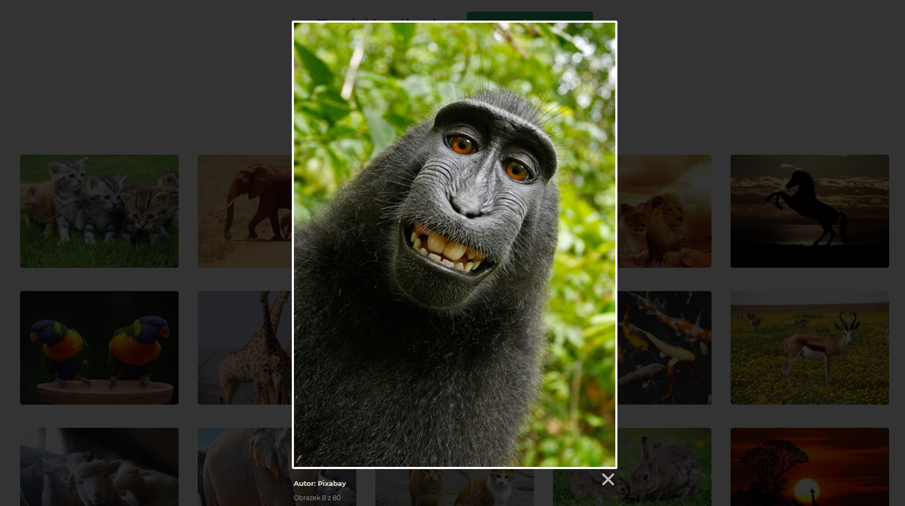

# Search Image Pexels

> Search API Engine created using pure Javascript and SCSS. 

## Status
Project is finished.

## Features

- Search images from Pexels.com API
- Shown as a gallery
- Good quality
- Simple animation

## Compilation and usage

* git clone
* npm install 
* npm run dev
> Then go to http://localhost:1234/ and see results

## Screenshots

    

    

    

### License

MIT
